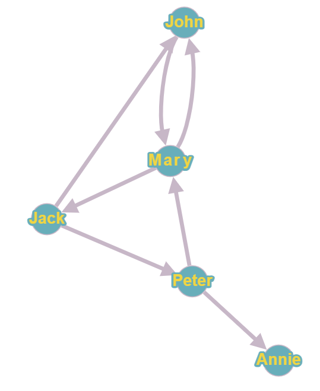
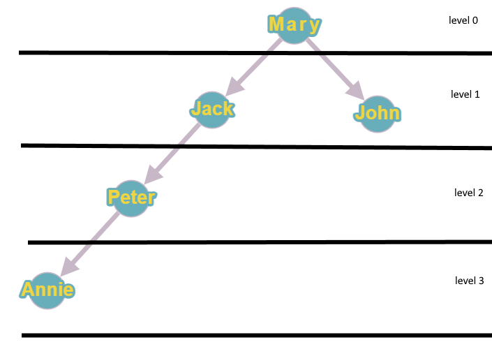

# The task

The provided source code implemets a "Friends" model consisting of people with given properties and relationships among them.

The task is to complete the implementation of three interfaces - `IFriendsModel`, `IFriendsModelFactory`, `IPerson` - so that when the program runs all the tests pass successfully.

## Guidelines and Restrictions
* In the expected solution you need to modify the `FriendsModel` and `FriendModelFactory` classes. You may make all kinds of modifications.

* You may use additional libraries and add new classes and types, if and as needed.

* You *may* modify any of the provided three interfaces, as long as the exsiting interface contracts are not broken.

* You may *not* modify the tester class or circumvent its intended behaviour in any way.

## Additional information

### Input Data
The initial data used to populate the model needs to be retrieved from the provided text file `friendsDb.txt`.

* The input data constists of one or more strings, each containing information about a single person, separated by the pipe character (|)
*  Each string containing the information about a single person comprises the following fields, in order, separated by comma (,):
    - person id - unique identifier for the person. May not be empty.
    - name - the person's name. May not be empty.
    - age - the person's age. A decimal integer.
    - mood - zero or more strings, separated by semicolon (;), representing the person's mood(s). The strings may contain only the following values: "angry", "sad", "happy", "bored", "calm", which need to be interpreted in a case-insensitive manner. Values may not be repeated.
    - friends - zero or more strings, separated by semicolon (;), each containing the id of another person present in the input data. Ids may not be repeated.
* The number of people defined in the input data may not exceed 10000

The input data in the provided text file is assumed to always be valid, i.e. conform the description above.

Note that "friendship" is not bi-directional, i.e. if A is a friend of B, B may or may not be a friend of A.
`friends.png` contains a sample visualization of the friend relationships defined in the provided text file 

### The "Social Bubble"

One of the methods that need to be implemented returns a person's "Social Bubble". This is defined as the set of person's direct and indirect friends (i.e. friends of friends included, at arbitrary depth), together with the "path" along the friendship chain traversed to reach an indirect friend.

The "path" needs to be a list of people's names. If multiple paths exist, one of the shortest paths is to be returned.

For example, let's examine Mary's social bubble at several depths (see `friendsOfMary.png` for reference)

Depth 0: The social bubble is empty

Depth 1: The social bubble has two elements: Jack,path:[] and John,path[].

Depth 2: Elements from depth 1 plus one additional element: Peter(path:["Jack"])

Depth 3: Elements from depth 2 plus one additional element: Annie, path:["Jack","Peter"]

The method accepts a parameter which can be used to filter the elements returned. Note that filtering out an element does not break the chain of friendships, e.g. in Mary's social bubble at depth >=3: if Jack is filtered out, Peter and Annie must still be present in the returned result set and, Jack must still be present in their paths.
